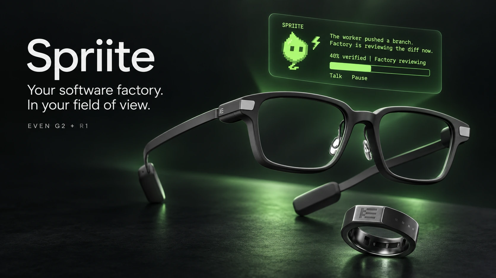
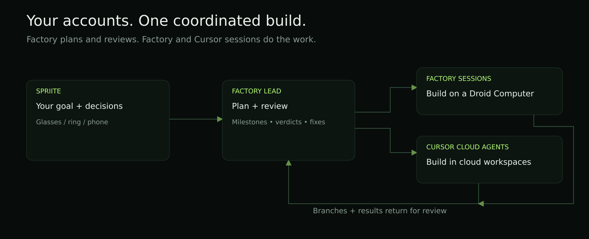
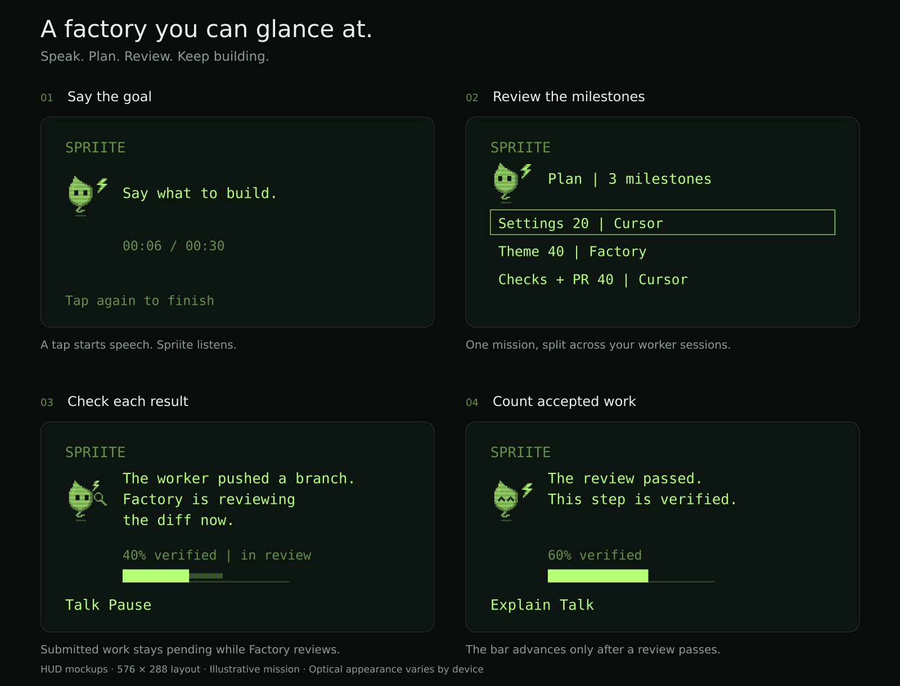
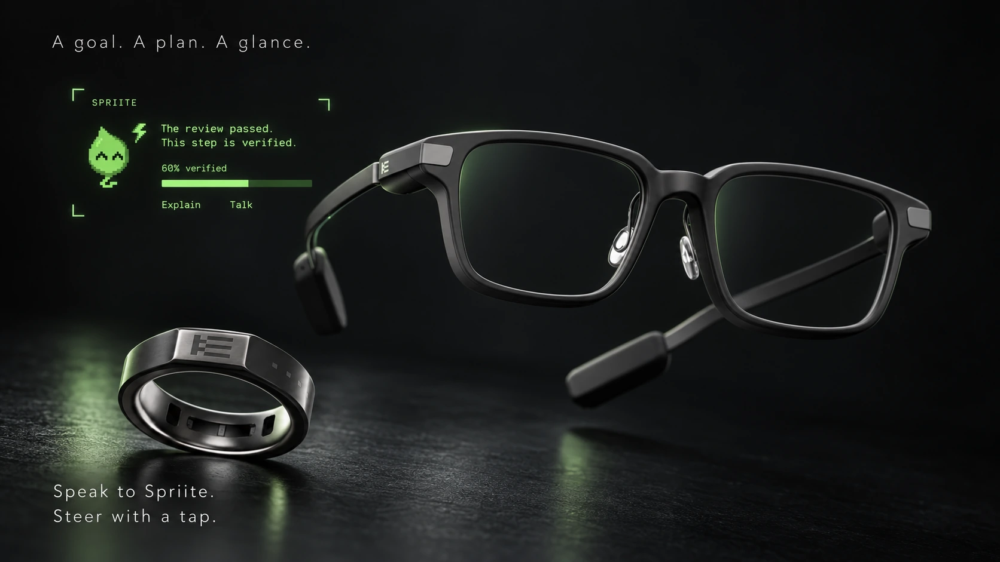

<p align="center">
  
</p>

<h1 align="center">Spriite</h1>

<p align="center"><strong>Run your software factory from your glasses.</strong></p>

<p align="center">
  <a href="#how-it-works">How it works</a> ·
  <a href="#get-started">Get started</a> ·
  <a href="docs/SETUP.md">Setup guide</a> ·
  <a href="CONTRIBUTING.md">Contribute</a>
</p>

<p align="center">
  <a href="LICENSE"></a>
  <a href="https://www.evenrealities.com/"></a>
  <a href="https://factory.ai/"></a>
</p>

Tell Spriite what to build. A Factory lead session turns your goal into milestones, delegates them to **Factory sessions and Cursor cloud agents**, and reviews the work as it lands. Your glasses show the progress, the next decision, and a small hovering companion.

Use your own accounts and GitHub repositories. Speak to steer a mission, tap the ring to answer a question, and open the phone companion when you need more detail.

## How it works



1. **Say the goal.** “Add dark mode to the settings page.”
2. **Review the plan.** Factory drafts weighted milestones. You confirm before workers start using your credits.
3. **Let the workers build.** Run one worker or up to four in parallel, on separate branches. Choose Factory, Cursor, or a mix.
4. **Review as work lands.** Factory inspects each branch and returns a verdict. Failed work goes back to its worker with the reasons.
5. **Integrate the result.** Accepted branches come together for a final review. Open a pull request automatically or confirm first.

**Progress means accepted work.** A submitted milestone stays pending until its review passes. Repairs earn no extra credit; a regression visibly takes its credit back.

Factory is the lead and reviewer in the current connected implementation. Factory sessions run on your chosen Droid Computer—your own connected machine or a Factory-managed cloud computer. Cursor workers run in Cursor cloud workspaces.

## In your field of view



Spriite listens, plans, checks, and asks short questions. Its pixel character hovers, blinks, and changes pose with the mission. The HUD keeps code and logs out of the conversation; milestones and decisions get the space.

| Control | What you do |
|---|---|
| **Voice** | Tap Talk, say a goal or instruction, then tap again to finish. “Hey Spriite” wakes it during voice capture. |
| **Ring or temple** | Swipe between actions, tap to choose, double-tap to go back. At home, double-tap opens the system exit dialog. |
| **Phone** | View the mission and activity, type an instruction, connect accounts, and set worker preferences. |

Consequential voice commands show a readback before they run. The phone also lists existing Factory and Cursor builds; you can monitor them and steer those that support messages. Closing Spriite preserves the mission for the next launch. Pausing stops the orchestrator; an already running worker continues in the background.

<p align="center">
  
</p>

<sub>Product visualizations and HUD mockups, not captured lens footage. The HUD examples follow the app’s 576 × 288 layout and use its pixel frames. Font rendering, brightness, and optical placement vary on hardware.</sub>

## Get started

Spriite is **bring your own relay**: you build your own copy against a relay you host and install it from your own Even Hub developer account. There is no store listing and no shared relay, so your keys only pass through infrastructure you control. (The Even app lets a build reach only the exact addresses packed into it, so one build can't serve everyone's relay.)

| You need | For |
|---|---|
| **Even Realities G2** | The HUD. The R1 ring is optional; temple controls also work. |
| **Factory API key + online Droid Computer** | Planning, review, and Factory workers. Required even when Cursor builds. |
| **GitHub repository** | Branches and pull requests. GitHub credentials must be available to your workers. |
| **Your own HTTPS relay** | Installed builds reach Factory and Cursor through a small relay you host. Your build reaches only your relay. |
| **Even Hub developer account** | You upload your build to your own project there. |
| **ElevenLabs key** | Recommended for live speech-to-text. |
| **Cursor API key** | Optional cloud workers. |
| **GitHub token** | Optional repository picker and new-repository creation. |

For a local preview:

```bash
git clone https://github.com/VontariusF/spriite.git
cd spriite
npm install
npm run dev
```

Open the local page and say or type **“run the demo”** to try the labeled simulation without agent accounts or credits. To use the glasses simulator, run `npm run sim` in another terminal while the dev server is running.

**[Follow the setup guide →](docs/SETUP.md)** for relay deployment, packaging, Even Hub installation, and account connections. Use a beta build for daily use with the phone locked; a private build is best for quick checks.

## Your keys, your setup

The app runs in the glasses’ paired phone app. Keys are saved on your phone. The relay forwards requests to Factory and Cursor; it stores and logs nothing. Agent execution and speech transcription still use the providers you connect.

Factory workers use the GitHub credentials on their Droid Computer. Cursor workers use the GitHub access configured in Cursor. A repository token in Spriite is for repository selection and creation; it does not replace worker authentication.

[Privacy](PRIVACY.md) · [Security](SECURITY.md) · [Relay details](relay/README.md)

## Build with us

TypeScript + Vite, with an Even Hub device adapter. The mission engine, scene contract, and phone companion are separate from the hardware layer, so other HUD glasses can be supported with an adapter.

[Development guide](docs/DEVELOPMENT.md) · [Contributing](CONTRIBUTING.md) · [Report an issue](https://github.com/VontariusF/spriite/issues)

---

Built by **[Vontarius Falls](https://vontarius.xyz/)**. Built in **[Factory](https://factory.ai/)**.

[Website](https://vontarius.xyz/) · [X / @VontariusF](https://x.com/VontariusF) · [LinkedIn](https://linkedin.com/in/vontarius-falls) · [GitHub](https://github.com/VontariusF) · [NYC AI Accelerator](https://nycaiaccelerator.com/)

Apache License 2.0 · [License](LICENSE) · [Notice](NOTICE)

